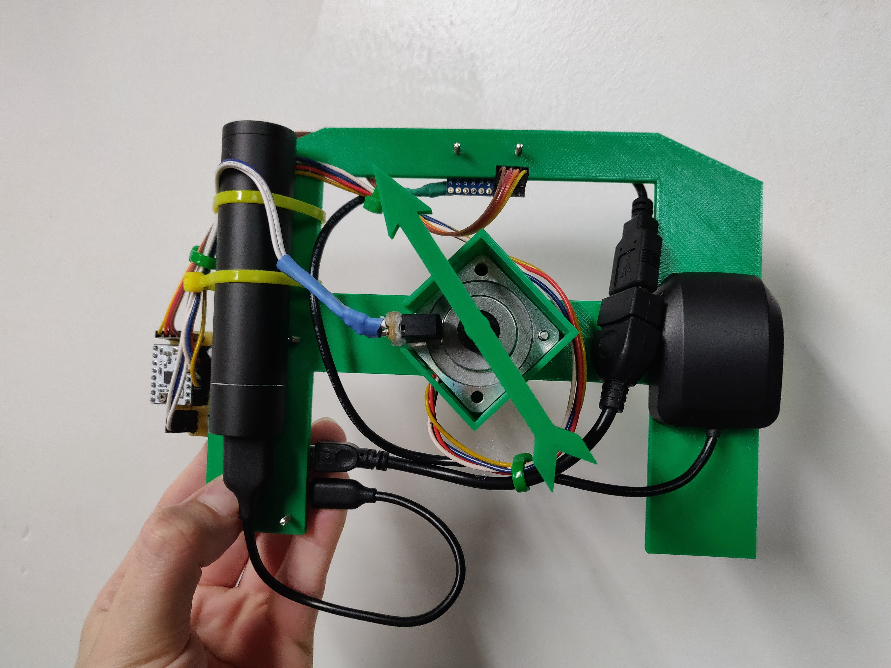

# Taco Compass
Using a Raspberry Pi, a custom connector Pi hat, a USB GPS and a 9-dof IMU, and scraped google places API data, I have made a plush taco that acts as a compass pointing at the nearest taco restaurant. 

